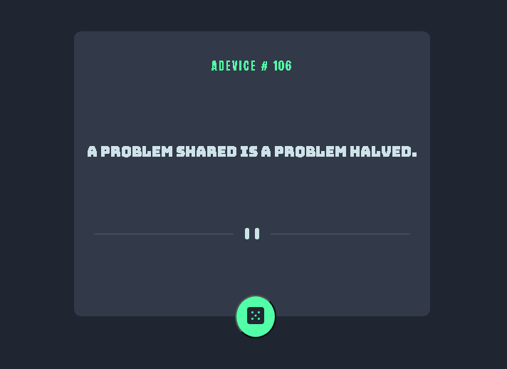

# projeto-teste
My project aims to practice API consumption,
this api returns me random advice.
I created an app that when clicking on the button is shown
an advice on screen.
[]

## tecnologias utilizadas 

-html 

-css 

-js 

## como utilizar
 
1 - clone pro o projeto
```
 git clone <url>
 
 ```

 2 -acesse a pasta do projeto
 ```
 cd repositorio-com-readme

